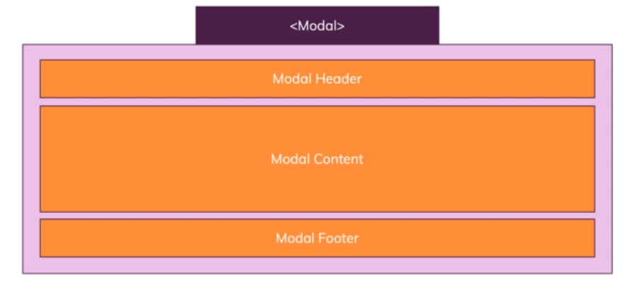

### Component Types


### Nested Components and Communication

A typical application built with Svelte looks something like this.

- Can have multiple root components
- Typically, each root component has a tree of subcomponents, which the components you use by embedding them by their tags with your custom tags in the markup of your app component


### Event Forwarding

Product.svelte:

```
        <article>
            <h1>{productTitle}</h1>
            <button on:click>Add to Cart</button>
            <button>Delete</button>
        </article>
```

App.svelte:

```
        <Product productTitle="A book" on:click={() => alert("Clicked!")} />
```

### Emitting Custom Events

Product.svelte:

```
        <script>
            import { createEventDispatcher } from "svelte"

            export let productTitle

            const dispatch = createEventDispatcher()

            function addToCart() {
                dispatch("add-to-cart", {id: "p1"})
            }
        </script>

        <article>
            <h1>{productTitle}</h1>
            <button on:click="{addToCart}">Add to Cart</button>
            <button on:click="{() => {dispatch("delete", "p1")}}">Delete</button>
        </article>
```

App.svelte:

```
        <Product productTitle="A book" on:add-to-cart={() => alert("Add to cart!")} on:delete={()  => alert("Delete!")} />
```

### How to Extract Event Data

App.svelte:

```
        <script>
            import Product from "./Product.svelte"

            function addToCart(event) {
                console.log(event.detail)
            }

            function deleteProduct(event) {
                console.log(event.detail)
            }
        </script>

        <Product productTitle="A book" on:add-to-cart={addToCart} on:delete={deleteProduct} />
```

### Using Spread Props and Default Props

Product.svelte:

```
        <script>
            import { createEventDispatcher } from "svelte"

            export let title
            export let price
            export let bestseller = false

            const dispatch = createEventDispatcher()

            function addToCart() {
                dispatch("add-to-cart", {id: "p1"})
            }
        </script>

        <article>
            <h1>{title}</h1>
            <h2>${price}</h2>
            {#if bestseller}
                <h3>BESTSELLER</h3>
            {/if}
            <button on:click="{addToCart}">Add to Cart</button>
            <button on:click="{() => {dispatch("delete", "p1")}}">Delete</button>
        </article>
```

App.svelte:

```
        <script>
            import Product from "./Product.svelte"

            let products = [
                {
                    id: "p1",
                    title: "A book",
                    price: 9.99
                }
            ]

            function addToCart(event) {
                console.log(event.detail)
            }

            function deleteProduct(event) {
                console.log(event.detail)
            }
        </script>

        {#each products as product}
            <Product {...product} on:add-to-cart={addToCart} on:delete={deleteProduct} />
            <!-- <Product title={product.title} price={product.price} on:add-to-cart={addToCart} on:delete={deleteProduct} /> -->
        {/each}
```

### Working with Slots



Modal.svelte:

```
        <div class="modal">
            <slot />
        </div>
```

App.svelte:

```
        <Modal>
            <h1>Hello!</h1>
            <p>This works!</p>
        </Modal>
```

### Named and Default Slots

Modal.svelte:

```
        <div class="backdrop" on:click={() => dispatch("cancel")} />

        <div class="modal">
        <header>
            <slot name="header" />
        </header>
        <div class="content">
            <slot />
        </div>
        <footer>
            <slot name="footer">
            <button on:click={() => dispatch("close")}>Close</button>
            </slot>
        </footer>
        </div>
```

App.svelte:

```
        <button on:click={() => (showModal = true)}>Show Modal</button>

        {#if showModal}
            <Modal on:cancel={() => (showModal = false)} on:close={() => (showModal = false)}>
                <h1 slot="header">Hello!</h1>
                <p>This works!</p>
                <button slot="footer" on:click={() => (showModal = false)}>Confirm</button>
            </Modal>
        {/if}
```

### Using Slot Props

Modal.svelte:

```
        <div class="backdrop" on:click={() => dispatch("cancel")} />

        <div class="modal">
        <header>
            <slot name="header" />
        </header>
        <div class="content">
            <slot />
        </div>
        <div class="disclaimer">
            <p>Before you close, you need to agree to our terms!</p>
            <button on:click={() => (agreed = true)}>Agree</button>
        </div>
        <footer>
            <slot name="footer" didAgree={agreed}>
            <button on:click={() => dispatch("close")} disabled={!agreed}>Close</button>
            </slot>
        </footer>
        </div>
```

App.svelte:

```
        <button on:click={() => (showModal = true)}>Show Modal</button>

        {#if showModal}
        <Modal on:cancel={() => (showModal = false)} on:close={() => (showModal = false)} let:didAgree={closable}>
            <h1 slot="header">Hello!</h1>
            <p>This works!</p>
            <button slot="footer" on:click={() => (showModal = false)} disabled={!closable}>Confirm</button>
        </Modal>
        {/if}
```

### The Component Lifecycle - Theory


### Creation and Update Lifecycle Hooks in Action

```
        <script>
            import { createEventDispatcher, onMount, onDestroy, beforeUpdate, afterUpdate } from "svelte"

            const dispatch = createEventDispatcher()

            let agreed = false
            let autoscroll = false

            onMount(() => {
                console.log("onMount")
            })

            onDestroy(() => {
                console.log("onDestroy")
            })

            beforeUpdate(() => {
                console.log("beforeUpdate")
                autoscroll = agreed
            })

            afterUpdate(() => {
                console.log("afterUpdate")
                if (autoscroll) {
                const modal = document.querySelector(".modal")
                modal.scrollTo(0, modal.scrollHeight)
                }
            })

            console.log("Script executed!")
        </script>
```

### Using tick()

```
        function transform(event) {
            if (event.which !== 9) {
            return
            }
            event.preventDefault()

            const selectionStart = event.target.selectionStart
            const selectionEnd = event.target.selectionEnd
            const value = event.target.value

            text = value.slice(0, selectionStart) + value.slice(selectionStart, selectionEnd).toUpperCase() + value.slice(selectionEnd)

            // give you a promise allowing you to run code after the next micro task has been completed
            tick().then(() => {
            event.target.selectionStart = selectionStart
            event.target.selectionEnd = selectionEnd
            })

            // this will not work!
            // event.target.selectionStart = selectionStart
            // event.target.selectionEnd = selectionEnd
        }

        <textarea rows="5" value={text} on:keydown={transform} />
```
