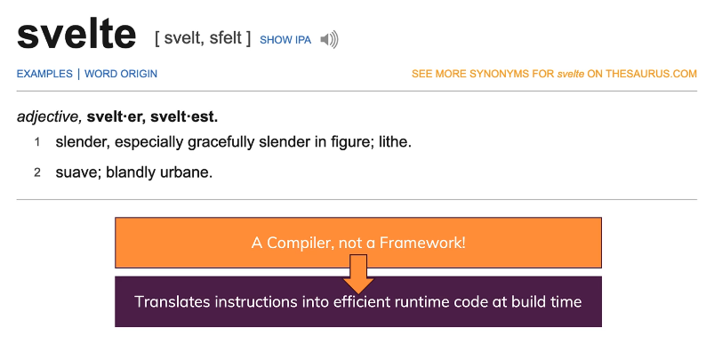

### Modern Web Applications

- Best possible way building web apps
  

### Dynamic Websites

### Svelte

- Allows us to build lightweight modern web applications that use JavaScript but highly optimized JavaScript where you ship as little code as required
- All that code is not just small in size but also very efficient when executed in the browser, hence giving us a very fast application (to load and to run it)
- It is a compiler, not a Framework!

## Content

[01-Base Styntax](01-BaseSyntax/README.md)
